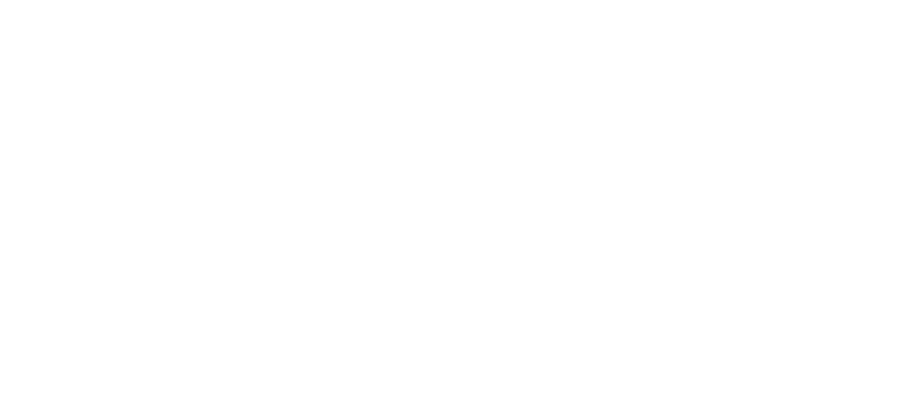

# About AIXPERT

<!-- Add logo -->

  

The **AIXpert Project** is a large-scale, multi-institutional research initiative uniting **17 partners** under the **Horizon Europe Research and Innovation Programme (Grant Agreement No. 101214389)** and the **Swiss State Secretariat for Education, Research and Innovation (SERI)**.

It aims to transform how AI is **developed**, **deployed**, and **trusted** by society, through a comprehensive framework for **explainable**, **transparent**, and **accountable** artificial intelligence.

---

## Vision

An **agentic, multi-layer, GenAI-powered backbone** to make AI systems **explainable**, **accountable**, and **human-centered**.
The project envisions an adaptable and trustworthy AI ecosystem that integrates explainability, fairness, autonomy, and robustness at every stage of AI development.

---

## Objectives

- **Build an adaptable, explainable AI-agentic platform**
  Develop interoperable modules that connect explainability, accountability, and fairness.

- **Define and assess AI trustworthiness**
  Establish measurable criteria and indicators for evaluating the reliability and ethical alignment of AI systems.

- **Advance explainable multimodal foundation models**
  Drive research in interpretable vision–language–reasoning systems.

- **Demonstrate real-world impact through pilot use cases**
  Validate the framework across sectors including healthcare, employment, and education.

---

## Consortium Partners

The AIXPERT consortium brings together leading academic, research, and industry organizations across Europe:

**Athena Research Center**, **University of Barcelona**, **Amsterdam UMC**, **KYKLOS**, **Workable**, **University of Groningen**, **Philips**, **Sorbonne University**, **CNRS**, **Furhat Robotics**, **Orfium**, **Novelcore**, **Infinity Design Labs**, **ITML**, **Barcelona Supercomputing Center**, **Martel Innovate**, and the **Vector Institute (Canada)**.

> The **Vector Institute** contributes expertise in *Responsible AI, bias detection, fairness benchmarking, and explainable data generation pipelines* within the global AIXPERT ecosystem.

---

## Learn More

- [:material-earth: Official Project Website](https://aixpert-project.eu/){ target="_blank" }
- [:material-linkedin: AIXPERT on LinkedIn](https://www.linkedin.com/company/aixpert-project/){ target="_blank" }
- [:material-twitter: AIXPERT on X](https://x.com/AIXPERT_project){ target="_blank" }
- [:material-youtube: AIXPERT on YouTube](https://www.youtube.com/@AIXPERT_project){ target="_blank" }

---

## Team

The [Vector Institute](https://vectorinstitute.ai/) is a proud partner of the [AIXPERT project](https://aixpert-project.eu/) — a Horizon Europe initiative building explainable, transparent, and human-centered AI. This site is maintained by Vector's AI Engineering team.

---
<link href="https://cdnjs.cloudflare.com/ajax/libs/font-awesome/5.15.4/css/all.min.css" rel="stylesheet">

  

    <h3>Shaina Raza, PhD</h3>
    
<a href="https://www.linkedin.com/in/shainaraza" title="LinkedIn" target="_blank" rel="noopener"><i class="fab fa-linkedin"></i> LinkedIn</a>

  

  

    <h3>Ahmed Y. Radwan</h3>
    
<a href="https://www.linkedin.com/in/ahmedyradwan/" title="LinkedIn" target="_blank" rel="noopener"><i class="fab fa-linkedin"></i> LinkedIn</a>

  

  

    <h3>Aravind Narayanan</h3>
    
<a href="https://www.linkedin.com/in/aravind-n-774665144" title="LinkedIn" target="_blank" rel="noopener"><i class="fab fa-linkedin"></i> LinkedIn</a>

  

  

    <h3>Vahid Khazaie</h3>
    
<a href="https://www.linkedin.com/in/vahid0001/" title="LinkedIn" target="_blank" rel="noopener"><i class="fab fa-linkedin"></i> LinkedIn</a>

  

---

## Acknowledgment

> Resources used in preparing this research were provided, in part, by the Province of Ontario, the Government of Canada through CIFAR, and companies sponsoring the Vector Institute.
>
> Funding for the research was partly provided through Horizon Europe project AIXpert: An agentic, multi-layer, GenAI-powered backbone to make an AI system explainable, accountable, and transparent (ID: 101214389).

<!-- Bottom acknowledgment logos -->

    
    

