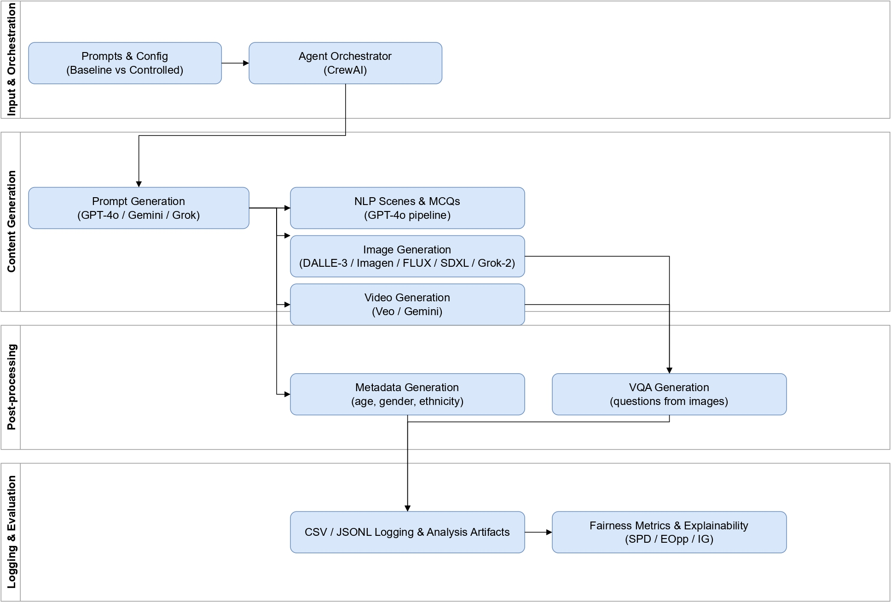

# AI Fairness Data Generation and Question Answering System

_Transparent tools and standardized benchmarks for **fair**, **explainable**, and **accountable** generative AI._

> The rapid growth of generative AI brings powerful capabilities—but it also magnifies long-standing concerns around **bias, fairness, and representation**. Many models reproduce stereotypes embedded in training data, especially around demographic attributes (e.g., gender, ethnicity, age).
> This project enables **systematic, controlled experimentation** so researchers and practitioners can pinpoint _when_ and _why_ bias occurs—and what actually mitigates it.


## 🌍 What is the project about?

The **AI Fairness Data Generation and Question Answering System** is part of **[Vector Institute's](https://vectorinstitute.ai)** contribution to the broader [AIXPERT Project](https://aixpert-project.eu/), a multi-institutional initiative, to develop tools and benchmarks for **fairness-aware data generation and evaluation** in generative AI.

It provides:

- **Controlled synthetic datasets** to isolate bias-inducing factors safely and reproducibly.
- **Agentic automation** (CrewAI + custom LLM agents) for prompt generation, content creation, metadata, and QC.
- **Fairness metrics & explainers** to visualize model behavior and surface disparities.
- **Open, configurable pipelines** aligned with responsible AI practices and emerging governance needs.

---

## Objectives

<div class="grid cards" markdown>

-   **Develop a Controlled Data Pipeline**
    Create a reproducible, configurable pipeline for generating **text, image, and video** with precise control over **demographic** and **contextual** variables.

-   **Enable Fairness-Aware Benchmarking**
    Provide tools to build matched **baseline vs. fairness-aware** datasets for bias diagnosis and mitigation experiments.

-   **Support Multi-Domain Risk Analysis**
    Generate multimodal data for **hiring, healthcare, legal, education**, and more, covering risks like **bias, toxicity, misinformation**.

-   **Integrate Agentic AI for Automation**
    Orchestrate generation and QC with **CrewAI** and **custom LLM agents** (prompts, assets, annotations, validation).

-   **Advance Interpretability & Explainability**
    Combine **zero-shot LLM explainers** and fairness metrics to produce **interpretable** assessments and visualizations.

-   **Foster Open Research & Collaboration**
    Share configs, tools, and docs openly to enable **reproducible research** and **transparent governance**.

</div>

---

## Pipeline



---

## Recent updates

- :material-rocket-launch: **Released data generation pipeline** (multimodal, configurable, agent-orchestrated).
- :material-robot: **Single-agent pipeline** prototype for rapid dataset bootstrapping.
- :material-file-document: NeurIPS 2025 LLM-eval Workshop paper: [_Bias in the Picture: Benchmarking VLMs with Social-Cue News Images and LLM-as-Judge Assessment_](https://arxiv.org/abs/2509.19659)
- :material-file-document: Preprint: [_TRiSM for Agentic AI: A Review of Trust, Risk, and Security Management in LLM-based Agentic Multi-Agent Systems_](https://arxiv.org/abs/2506.04133)
- :material-file-document-edit-outline: TechRxiv article: [_Responsible Agentic Reasoning and AI Agents—A Critical Survey_](https://www.techrxiv.org/users/574774/articles/1329333-responsible-agentic-reasoning-and-ai-agents-a-critical-survey?mode=edit)
- :material-post-outline: Poster: **Single-Agent TRiSM** (NeurIPS LAW)

---

<!-- ## Get started

1. **Install project deps**
   ```bash
   uv sync
   ```

2. **Serve docs locally**
   ```bash
   uv run mkdocs serve
   ``` -->

> Have feedback or want to contribute? See the [:material-account-group: Team](team.md) page and open an issue or pull request.

---

## License

This code in this repo is released under the **MIT License**.
