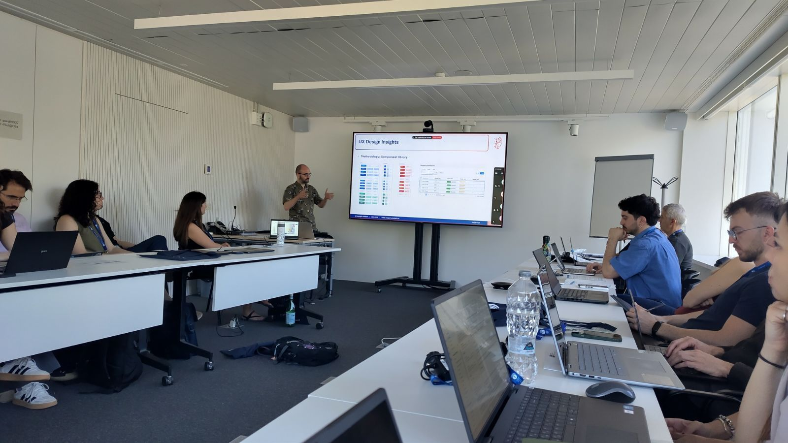
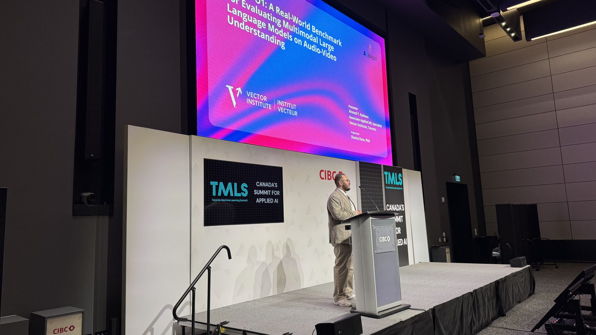
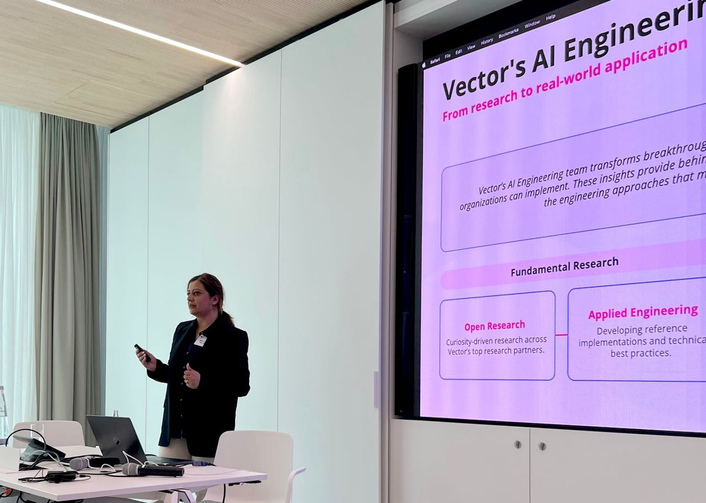
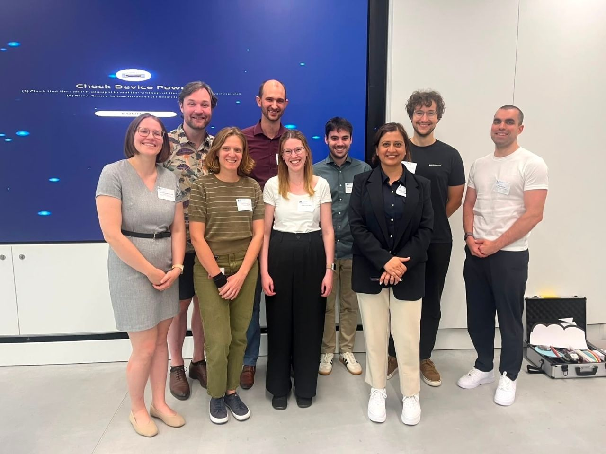

# Updates

Full list of recent papers, releases, and news.

---

- :material-scale-balance: **UnBias-Plus** — Toolkit for bias detection and debiasing in text (segmentation, severity, reasoning, replacements, full rewrite). [Project page](https://vectorinstitute.github.io/unbias-plus/) · [Code](https://github.com/VectorInstitute/unbias-plus) · [PyPI](https://pypi.org/project/unbias-plus/).

- :material-map-marker: **AIXpert General Assembly — Barcelona 2026** — The AIXPERT consortium met at the [Barcelona Supercomputing Center](https://www.bsc.es/) (3–4 June 2026) for its second-year General Assembly and Technical Meeting. Partners aligned the technical roadmap, validated implementation plans across five pilot domains (healthcare, recruitment, manufacturing, education, and creative industries), and prepared the next phase of platform development. [Read more](https://aixpert-project.eu/2026/06/05/ga-bcn-june2026/).

  

- :material-presentation: **Toronto Machine Learning Summit** — Ahmed Y. Radwan presented **SONIC-O1** at the [Toronto Machine Learning Summit](https://www.torontomachinelearning.com/) (16–19 June 2026, Toronto). SONIC-O1 is a real-world benchmark for evaluating multimodal LLMs on audio-video understanding across 13 conversational domains, featuring a public leaderboard for model comparison and fairness analysis.

  [Project page](https://vectorinstitute.github.io/sonic-o1/) · [Code](https://github.com/VectorInstitute/sonic-o1) · [Dataset](https://huggingface.co/datasets/vector-institute/sonic-o1) · [Leaderboard](https://huggingface.co/spaces/vector-institute/sonic-o1-leaderboard)

  
  

- :material-handshake: **HAICON26 & Vector–Helmholtz Munich MOU** — Shaina Raza, PhD presented at the [Helmholtz AI Conference 2026: AI for Science](https://haicon.cc/) (8–11 June 2026, Munich). The visit coincided with the signing of a **Memorandum of Understanding (MOU)** between Vector Institute and Helmholtz Munich's Computational Health Center, establishing a formal framework for joint research, researcher exchanges, faculty affiliations, and coordinated Germany–Canada funding programs.

  [Helmholtz Munich](https://www.helmholtz-munich.de/en/newsroom/news-all/artikel/helmholtz-munich-and-vector-institute-strengthen-international-ai-research-collaboration) · [Press release (GlobeNewsWire)](https://www.globenewswire.com/news-release/2026/06/11/3310530/0/en/vector-institute-and-helmholtz-munich-sign-mou-to-advance-international-ai-and-machine-learning-research.html) · [AI Magazine](https://aimagazine.com/globenewswire/3310530) · [BNN Bloomberg](https://www.bnnbloomberg.ca/press-releases/2026/06/11/vector-institute-and-helmholtz-munich-sign-mou-to-advance-international-ai-and-machine-learning-research/)

  
  

- :material-leaf: **ICML 2026 Poster** — [_Position: Sustainable Open-Source AI Requires Tracking the Cumulative Footprint of Derivatives_](https://arxiv.org/abs/2601.21632) accepted as a poster at ICML 2026. Shaina Raza, Ahmed Radwan, and co-authors propose **Data and Impact Accounting (DIA)** to make the cumulative environmental footprint of open-source AI model derivatives visible and accountable. [Project page](https://vectorinstitute.github.io/ai-impact-accounting/).

- :material-video-off: **Deepfake Video Review** — [_Generative Deepfake Videos in the Foundation-Model Era: A Timeline of Eroding Trust in Visual Evidence_](https://dl.acm.org/doi/full/10.1145/3810988.3812659) published at MAD '26 (ACM Workshop on Multimedia AI against Disinformation, June 2026). Shaina Raza, Jessee Ho, Mahveen Raza, Christos Emmanouilidis.

- :material-trophy: **The Peak Emerging Leaders 2026** — Shaina Raza, PhD has been recognized in [The Peak's Emerging Leaders 2026](https://emergingleaders.readthepeak.com/2026/artificial-intelligence) list, celebrating Canada's most promising young leaders in **Artificial Intelligence**.

- :material-shield-search: **FairSense-AgentiX** — Agentic fairness and AI-risk platform for text, images, and datasets (FastAPI, WebSocket, React UI, Python API). [Project page](https://vectorinstitute.github.io/fairsense-agentix/) · [Code](https://github.com/VectorInstitute/fairsense-agentix) · [PyPI](https://pypi.org/project/fairsense-agentix/).

- :material-presentation: **HAICON26** — Shaina Raza, PhD presenting at the [Helmholtz AI Conference 2026: AI for Science](https://haicon.cc/) (8–11 June 2026, Munich, Germany).

- :material-presentation: **Toronto Machine Learning Summit** — Ahmed Y. Radwan presenting **SONIC-O1** at the [Toronto Machine Learning Summit](https://www.torontomachinelearning.com/) (16–19 June 2026). [Project page](https://vectorinstitute.github.io/sonic-o1/) · [Code](https://github.com/VectorInstitute/sonic-o1) · [Dataset](https://huggingface.co/datasets/vector-institute/sonic-o1) · [Leaderboard](https://huggingface.co/spaces/vector-institute/sonic-o1-leaderboard).

- :material-presentation: **AI4Good Lab 2026** — Shaina Raza, PhD and Ahmed Y. Radwan presented **UnBias-Plus** and research on disinformation and misinformation detection to the [AI4Good Lab](https://www.ai4goodlab.com/) 2026 cohort (May–June 2026, Toronto). The AI4Good Lab is a full-time summer ML training program for women and gender diverse people across Canada, hosted in Toronto in partnership with Vector Institute and CIFAR.

- :material-check-decagram: **Evaluating and Regulating Agentic AI** — Forthcoming in *Information Fusion* (journal page to follow). [_Evaluating and Regulating Agentic AI: A Study of Benchmarks, Metrics and Regulation_](https://www.techrxiv.org/doi/abs/10.36227/techrxiv.176186841.18883348/v3) (arXiv). [Project page](https://itsazibfarooq.github.io/agenticEvaluation/) · [Code](https://github.com/itsazibfarooq/agenticEvaluation).

- :material-presentation: **EU cluster webinar — AI in public services** — We contributed to the webinar *AI-Enabled Public Services: Building Resilience and Accountability* (20 April 2026, 10:00 CEST). The session was the second joint online event organized by the EU-funded projects **TANGO**, **AI4REALNET**, **HumAIne**, **THEMIS 5.0**, and **Peer AI**, bringing together speakers on how these initiatives use AI in public-service settings, with emphasis on **resilience** and **accountability**. Registration was open to the general public, researchers, and policy makers; registered participants received the detailed agenda in the weeks before the event.

- :material-check-decagram: **Model immunization (AI vaccine)** — Accepted at WCCI 2026 (IJCNN). [_Just as Humans Need Vaccines, So Do Models: Model Immunization to Combat Falsehoods_](https://arxiv.org/abs/2505.17870) (arXiv). [Project page](https://shainarazavi.github.io/ai-vaccine/) · [Code](https://github.com/shainarazavi/ai-vaccine).

- :material-check-decagram: **F-DPO** — ACL 2026 Findings. [_Reducing Hallucinations in LLMs via Factuality-Aware Preference Learning_](https://arxiv.org/abs/2601.03027) (arXiv). [Project page](https://vectorinstitute.github.io/Factual-Preference-Alignment/) · [Code](https://github.com/VectorInstitute/Factual-Preference-Alignment) · [Dataset](https://huggingface.co/datasets/vector-institute/Factuality_Alignment).

- :material-check-decagram: **TRiSM for Agentic AI accepted** — Paper accepted at [AI Open, Elsevier 2026](https://doi.org/10.1016/j.aiopen.2026.02.006). A review of trust, risk, and security management in LLM-based agentic multi-agent systems.

- - :material-chart-bar: **AgentFinVQA** — Multi-agent pipeline for auditable, on-premise financial chart QA with traceable Model Evaluation Packets. [Paper](https://arxiv.org/abs/2606.19782) · [Project page](https://vectorinstitute.github.io/AgentFinVQA/) · [Code](https://github.com/VectorInstitute/AgentFinVQA/).

- :material-presentation: **Remarkable 2026** — We presented AIXpert projects at Remarkable 2026.

  
  

- :material-robot: **SONIC-O1 Multi-Agent** — We released a compound multi-agent system for audio-video understanding. [Code](https://github.com/VectorInstitute/sonic-o1-agent).
- :material-file-document: **From Features to Actions** — Paper: [_Explainability in Traditional and Agentic AI Systems_](https://arxiv.org/abs/2602.06841) (arXiv). [Code](https://github.com/VectorInstitute/unified-xai-evaluation-framework) and [project page](https://vectorinstitute.github.io/unified-xai-evaluation-framework/).
- :material-book-open-variant: **Transparency in Agentic AI** — Survey: [_A Survey of Interpretability, Explainability, and Governance_](https://doi.org/10.31224/6451) (arXiv). [Project page](https://vectorinstitute.github.io/Agentic-Transparency/).
- :material-newspaper: **AIXpert news** — Our work was highlighted on the [AIXpert project website](https://aixpert-project.eu/2026/01/28/advancing-trustworthy-explainable-and-responsible-ai-at-neurips-2025/): *Advancing Trustworthy, Explainable, and Responsible AI at NeurIPS 2025* (Bias in the Picture, HumaniBench, Carbon Literacy, and more).
- :material-play-circle: **SONIC-O1** — Paper: [_A Real-World Benchmark for Evaluating MLLMs on Audio-Video Understanding_](https://arxiv.org/abs/2601.21666) (arXiv).
- :material-database: **SONIC-O1** — Dataset on [Hugging Face](https://huggingface.co/datasets/vector-institute/sonic-o1) (231 videos, ~60h, 4,958 QAs, 13 domains, demographic metadata).
- :material-github: **SONIC-O1** — [Code](https://github.com/VectorInstitute/sonic-o1) and evaluation pipeline (summarization, MCQ, temporal localization).
- :material-medal: **SONIC-O1** — [Leaderboard](https://huggingface.co/spaces/vector-institute/sonic-o1-leaderboard) for model comparisons and fairness analysis.
- :material-database: **F-DPO** — Factuality-aware preference [dataset](https://huggingface.co/datasets/vector-institute/Factuality_Alignment) on Hugging Face.
- :material-github: **F-DPO** — [Code](https://github.com/VectorInstitute/Factual-Preference-Alignment) and [project page](https://vectorinstitute.github.io/Factual-Preference-Alignment/) (factuality-aware DPO, no reward model).
- :material-rocket-launch: **Released data generation pipeline** (multimodal, configurable, agent-orchestrated).
- :material-robot: **Single-agent pipeline** prototype for rapid dataset bootstrapping.
- :material-file-document: **Paper:** [_Bias in the Picture: Benchmarking VLMs with Social-Cue News Images and LLM-as-Judge Assessment_](https://arxiv.org/abs/2509.19659) (NeurIPS 2025 LLM-eval Workshop)
- :material-file-document: **Paper:** [_TRiSM for Agentic AI: A Review of Trust, Risk, and Security Management in LLM-based Agentic Multi-Agent Systems_](https://arxiv.org/abs/2506.04133)
- :material-file-document-edit-outline: **Paper:** [_Responsible Agentic Reasoning and AI Agents—A Critical Survey_](https://www.techrxiv.org/users/574774/articles/1329333-responsible-agentic-reasoning-and-ai-agents-a-critical-survey?mode=edit) (arXiv)
- :material-post-outline: **Paper:** **Single-Agent TRiSM** (Poster, NeurIPS LAW)
